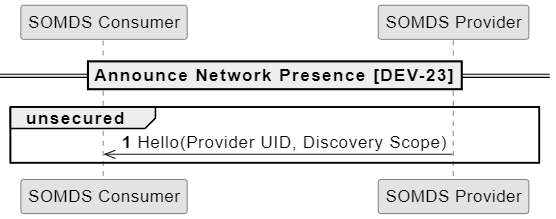
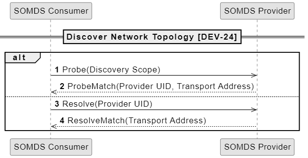

# Announce Network Presence [DEV-23]
-   Notify all SOMDS consumer that a MDS prSOovider is connected to the network and ready to exchange messages
    -   who notifies the consumer that SOMDS provider is connected to a network?
    -   BICEPS specifies an implicit discovery protocol for allowing SOMDS Consumers to receive a notification when a SOMDS Provider is ready to exchange messages ,the correspondign message is called Hello, and it not the actual transport message specifications like , e.g., the WS-Discvovery hello message as described in appendix 2:A.2.1
-   SOMDS- Service-oriented Medical Device System
## Messages

 ## Safety, Effectiveness and Security - Requirements and Considerations
 -  [SES](https://profiles.ihe.net/DEV/SDPi/index.html#vol1_clause_appendix_a_ses_considerations_and_requirements)
    Note: SES - Safetly, effectiveness and security considerations
# Discover Network Toppology [DEV-24]
-   SOMDS consumer initiates communication by sending Probe or Resolve messages to the SOMDS provider. Then listens
for ProbeMatch or ResolveMatch message to discover those SOMDS providers that it intends to exchange messages.
-   SOMDS provider listens to Probe and Resolve messages, which it responds to with ProbeMatch or ResolveMatch messages
respectively  

